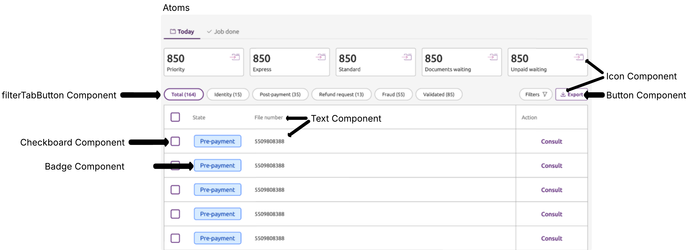
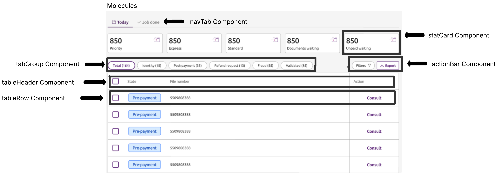
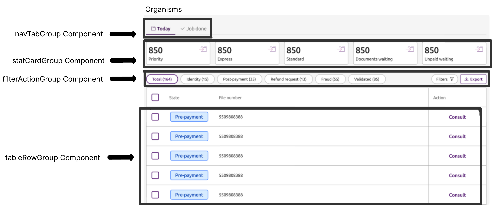
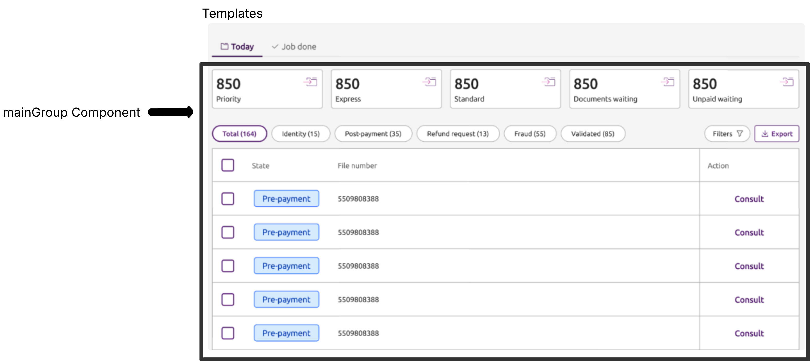
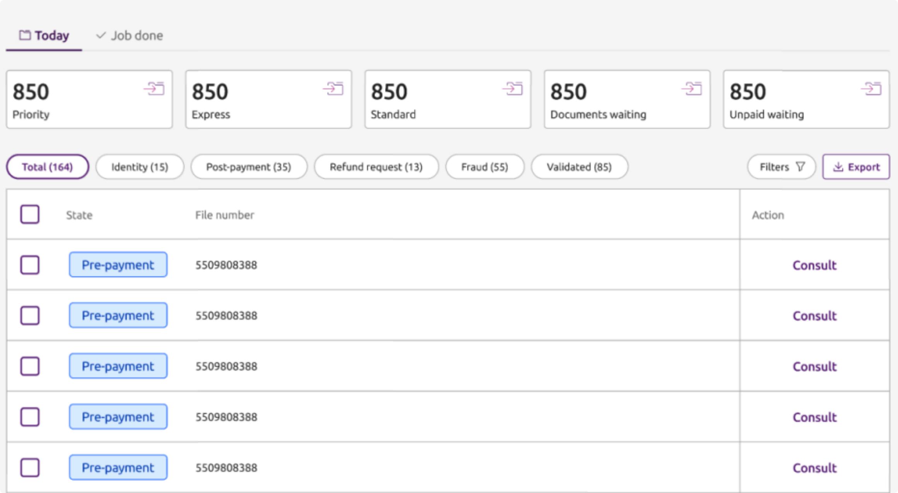

# Atomic SPA – Angular Single Page Application


This project is a technical demonstration of building a modular and scalable Single Page Application (SPA) using Angular and the Atomic Design methodology. The app displays a table of file data with filtering, sorting, and export functionality.

---


## 📆 Features

* ✅ Built with **Angular 20** using **Standalone Components**
* ✅ Atomic Design structure: **Atoms**, **Molecules**, **Organisms**, **Templates**, **Pages**
* ✅ **Sorting** by File Number
* ✅ **Filtering** by State via tab navigation
* ✅ **Export** table data to CSV
* ✅ Modern SCSS styling and BEM-like class structure
* ✅ Optional integration with **Storybook**

---

## 🧱 Atomic Design Breakdown

### 🔹 Atoms - The smallest functional UI elements

* `ButtonComponent`: Reusable button
* `IconComponent`: Material icon wrapper
* `CheckboxComponent`: Custom checkbox
* `TabComponent`: Single tab item

### 🔸 Molecules - Combinations of atoms

* `StatCardComponent`: Label + value stat cards
* `TableHeaderComponent`: Sortable column headers

### 🧩 Organisms - Groups of molecules that form distinct sections

* `NavTabGroupComponent`: Tab navigation filter
* `TableRowGroupComponent`: Table data rows
* `FilterActionGroupComponent`: Checkbox + export


### 🖼 Templates - Page layout containers

* `MainTemplateComponent`: Wraps page-level structure

### 📄 Pages - Fully rendered pages

* `DashboardPageComponent`: The SPA’s main interface

---

## 📁 Project Structure

```
src/app/
│
├── components/
│   ├── atoms/
│   ├── molecules/
│   ├── organisms/
│   ├── templates/
│   └── pages/
│
└── services/
```

---

## ⚙️ Setup Instructions

### 📌 Prerequisites

* Node.js (v18+)
* Angular CLI

#### ▶️ Run the app

```bash
npm install
ng serve
```

Navigate to `http://localhost:4200/`.

---

## 📚 Storybook (Optional)

To run Storybook and preview reusable components:

```bash
npm run storybook
```

---

## 📄 Export Functionality

Click the **"Export"** button to download the currently visible table data as a `.csv` file containing:

* `State`
* `File number`

---

## 🔍 Filtering Logic

Clicking on a tab will filter the table by the corresponding `state`.
All filtering is handled reactively via Angular Signals.

---

## 🧠 Design Approach

---
### 🗂️ UI Planning & Mock-up Segmentation

During the initial UI planning phase, I studied the provided mock-up to break down the interface into atomic levels. This process helped guide the structure of the application.

Below are the visual depictions that correspond to each level in Atomic Design:

#### 🧱 Atoms (e.g., Text, Button, Icons)



#### 🔸 Molecules (e.g., Tab group, Stat card, Tables)



#### 🧩 Organisms (e.g., Table row group, Stat gard group)



#### 🖼️ Templates (e.g., Overall layout frame)



#### 📄 Pages (e.g., Routed application views)




I followed the **Atomic Design methodology** to enforce modularity and scalability. Each component is clearly scoped and reusable. I used a combination of Angular Signals and traditional `@Input()`/`@Output()` bindings, depending on the use-case, to maintain flexibility and readability. Shared state logic and data transformations were handled via a dedicated service for centralised control and reusability across components.

### 📦 Shared Service Layer

To maintain clean separation of concerns and reusability, I implemented a `TableDataService` that encapsulates core logic used across components:

- **State Management**: Tracks selected tab and item selection using Angular Signals
- **Filtering Logic**: Filters the table by state using `filterByState()`
- **Sorting Logic**: Sorts by file number in ascending/descending order with `sortByFileNumber()`
- **CSV Export**: Converts table data into downloadable CSV format using `exportToCSV()` and triggers download with `downloadCSV()`

This abstraction ensures that UI components remain focused on presentation logic while business logic is centralised and testable.

Additionally, during the **Research and UI Planning** stage, I sketched diagrams (Seen above) to help segment the interface according to Atomic Design levels. These visual references guided decisions during implementation.

---

### 🛠 Additional Enhancements

- Custom favicon added for a polished and branded browser tab experience.
- Dynamic page title updates based on the active route for improved navigation clarity.
- Proof of concept Job Done page to simulate non-refreshing routing.

---

## 💡 Future Improvements

Given more time, I would:

* Research mobile responsiveness and accessibility
* Further testing of CSV export, sorting, and filtering
* Scale data handling for scaleable modular elements (Using API's and Data Containers)
* Integrate a design system like Angular Material fully or Tailwind
* Expand Storybook coverage with controls and interactions
* Adding more services (e.g. filter tab and row selection service) for resusable functions
* Include console logs for debugging purpuses
* Revist code to remove redundant stlying (scss)

---

## ⚠️ Known Limitations

- No unit or integration tests implemented (besides Storybook)
- Fully static mock data (no API connection)
- Responsive layout not fully tested on mobile devices

---

## 📚 References

- [Atomic Design by Brad Frost](https://atomicdesign.bradfrost.com/chapter-2/)
- [Atomic Design Methodology – Kamath Rohan](https://blog.kamathrohan.com/atomic-design-methodology-for-building-design-systems-f912cf714f53)
- [Storybook Documentation](https://storybook.js.org/docs)
- [Intro to Storybook Tutorial](https://storybook.js.org/tutorials/intro-to-storybook/)
- [MASTER Angular in 90 Minutes with This Crash Course](https://youtu.be/oUmVFHlwZsI?si=H8IYin_LNroogb2S)
- [Change Angular Application default Logo or Fevicon](https://www.youtube.com/watch?v=4Lx0JJosFDo)
- [Emojipedia](https://emojipedia.org/)
- [Flaticon](https://www.flaticon.com/)

---

## 📈 Learning Reflection

This project represents my **first ever Angular project**.

I began with no prior knowledge of Angular or Storybook and completed the entire application including component design, state management, styling, and Storybook integration within **3 days**.

This reflects my ability to **adapt quickly to new technologies**, learn under pressure, and deliver clean, structured solutions in a short timeframe.

---

## 📄 License

MIT – Feel free to reuse and modify this project.

---

## ✨ Credits

Developed by [Nathan Farrugia](https://github.com/NateFJF)
